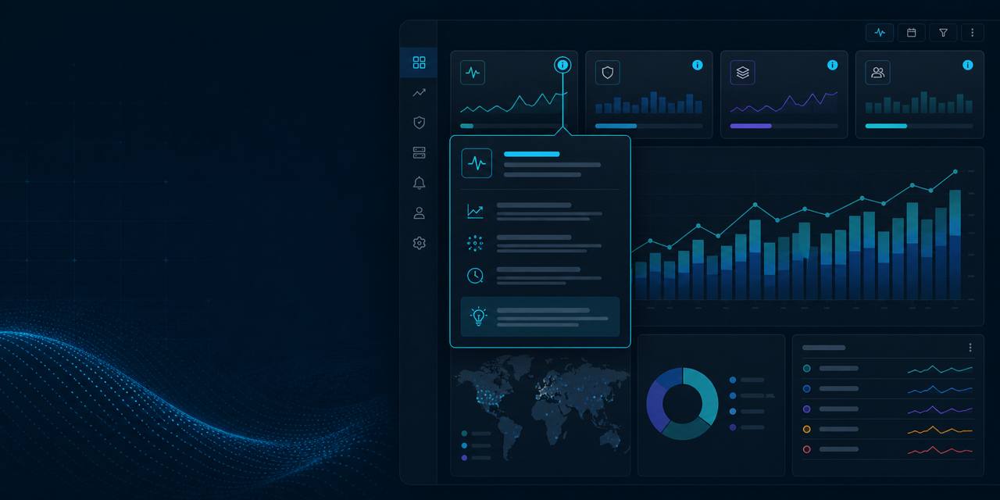

# Dashboard Help Badge

[](https://github.com/LeiterConsulting/dashboard-help-badge/actions/workflows/ci.yml)
[](LICENSE)
[](https://help.splunk.com/en/splunk-enterprise/create-dashboards-and-reports/dashboard-studio/10.4/whats-new-in-dashboard-studio/whats-new-in-dashboard-studio)

Reusable contextual-help elements for Splunk Dashboard Studio, built on the custom visualization extension framework introduced in Splunk Enterprise 10.4. Live tournament testing selected the token-controlled **Help Trigger + Help Panel** pair as the product pattern.

The app adds four visualization types and requires no SPL, index, input, custom REST handler, external service, or modification to Splunk itself.

| Element | Dashboard type | Best use |
| --- | --- | --- |
| Help Tooltip | `dashboard_help_badge.help_tooltip` | Fully styled, theme-aware content with hover, focus, click-to-pin, and Escape dismissal |
| Help Badge (Compact) | `dashboard_help_badge.help_badge` | A 50 × 50 badge whose browser-native tooltip can paint outside the visualization iframe |
| Help Trigger | `dashboard_help_badge.help_trigger` | A theme-aware 50 × 50 full-tile click target that toggles an author-configured dashboard token |
| Help Panel | `dashboard_help_badge.help_panel` | A styled companion panel shown by a Dashboard Studio token visibility condition |

## Requirements

- Splunk Enterprise 10.4+ or the corresponding Splunk Cloud Platform release
- Node.js 22+ and npm 10+ (development only)
- A modern browser supported by the target Splunk release

## Install and try it

1. Install the `.spl` or `.tar.gz` archive from `dist/` through **Apps > Manage Apps > Install app from file**.
2. Open **Dashboard Help Badge — Interactive Tutorial** from the app launcher and try the finished interaction.
3. Choose **Actions → Clone dashboard**, then edit the clone and follow the **2 · Build it** tab. The reference pair remains available as an answer key.
4. Use **3 · Source map** for code review or bulk authoring. Open **Dashboard Help Badge — Dark Theme** to verify theme behavior.

No Splunk restart is expected for the initial install. If an older copy with a different visualization contract is cached, restart Splunk before diagnosing the updated configuration.

For source-based testing, clone the public repository, run `npm ci && npm run verify`, and install the resulting `dist/*.spl` or `dist/*.tar.gz` archive. CI also publishes both verified formats as a short-lived workflow artifact.

## Placement patterns

### Token-controlled Help Trigger + Help Panel (recommended)

Place the 50 × 50 Help Trigger at the edge of the tile being explained and position Help Panel where its rich card should appear. The visible glyph stays compact, but the trigger's native button fills the complete 50 × 50 iframe: clicking beside the `i` works exactly like clicking the glyph. The trigger exposes keyboard focus and expanded state and follows the Dashboard Studio light/dark theme canvas.

Both elements share a token name and closed value. Dashboard Studio conditionally materializes the panel only when that token is open, so there is no large transparent or white iframe over the tile while help is closed. The panel dismisses through the trigger, its × control, or Escape.

### Rich Help Tooltip

The rich card must remain inside its sandboxed iframe. Put its transparent rectangular footprint in whitespace adjacent to the tile being explained and choose the icon anchor that touches the tile edge. The included demo shows this pattern.

The icon:

- opens on mouse hover by default;
- opens on keyboard focus;
- can be pinned with a click or tap;
- dismisses with Escape; and
- exposes its body with `role="tooltip"` and `aria-describedby`.

Dashboard Studio's iframe still owns the whole rectangle, including transparent pixels. Avoid placing that rectangle over controls or chart marks that must remain interactive.

### Compact Help Badge

Place the compact 50 × 50 footprint over or beside a tile corner. It uses the browser's native `title` tooltip, which is painted by the browser rather than by the iframe document. This is the small-footprint solution, with deliberate tradeoffs: tooltip delay, typography, color, placement, and wrapping are browser-controlled. Screen readers receive the complete help text through an accessible label.

## Configuration

Both elements accept:

- accessible label;
- heading and plain-text help body;
- information, question, or alert symbol;
- circle or rounded-square shape;
- icon size (clamped to 18–44 pixels); and
- hex accent color with an automatically selected black or white glyph for contrast.

The rich element also accepts:

- top-left, top-right, bottom-left, or bottom-right icon anchor;
- open-on-hover toggle;
- click-to-pin toggle; and
- heading visibility toggle.

The token-controlled pattern pairs **Help Trigger** (element 1 of 2) with **Help Panel** (element 2 of 2). Both use the same token name and closed value. The editor's interaction dialog can create the closed default while wiring `drilldown.setToken`; the author then adds a show condition under the panel's Visibility section. The packaged tutorial walks through every field and contains a working reference pair.

Splunk uses the same object write permission for entering edit mode and saving. There is no supported ACL for “preview edits but never save.” The installed tutorial is restricted to administrative writers; other readers should clone it to a private dashboard, and administrators should also clone it to preserve the answer key.

Content can reference Dashboard Studio tokens with familiar `$token_name$` syntax. Scalar and scalar-array token values are substituted as plain text; unknown or structured token values remain unchanged.

All configured content is written through `textContent`. The visualization does not interpret HTML, Markdown, URLs, expressions, or JavaScript.

## Dashboard source example

The winner pattern requires a trigger, a panel, a token event handler on both, and a panel visibility condition. This is the trigger half:

```json
{
  "type": "dashboard_help_badge.help_trigger",
  "options": {
    "accessibleLabel": "Toggle checkout latency help",
    "tokenName": "help_checkout",
    "openValue": "open",
    "closedValue": "closed",
    "accentColor": "#006d9c"
  },
  "eventHandlers": [{
    "type": "drilldown.setToken",
    "options": { "tokens": [{ "token": "help_checkout", "key": "value" }] }
  }]
}
```

See [`docs/AUTHORING_TUTORIAL.md`](docs/AUTHORING_TUTORIAL.md) for the visual-editor sequence, [`examples/minimal-dashboard.json`](examples/minimal-dashboard.json) for a complete Dashboard Studio definition, [`docs/TOURNAMENT.md`](docs/TOURNAMENT.md) for the bracket result, and [`docs/ARCHITECTURE.md`](docs/ARCHITECTURE.md) for the iframe design decision.

## Develop and package

```bash
npm install
npm run verify
```

`npm run verify` type-checks, runs the option/security unit tests, creates production bundles, and writes identical self-contained `.spl` and `.tar.gz` archives to `dist/`. The packager excludes macOS metadata, dotfiles, links, and paths outside the single app root.

Useful individual commands:

```bash
npm run typecheck
npm test
npm run build:prod
npm run package
```

The packager includes the interactive tutorial, advanced source map, dark verification dashboard, and navigation; applies explicit dashboard ACLs; generates `visualizations.conf`; exports all four visualization definitions system-wide; creates `app.manifest`; and leaves credentials and instance-local files out of the archive.

## Release readiness

Version 0.5.1 is structured as a public testing candidate for Splunkbase/AppInspect submission. Before publishing a release:

1. update the version in both `package.json` and `package/app/app.conf`;
2. run `npm run verify` from a clean checkout;
3. inspect the generated archive and run AppInspect in `precert` mode with the Cloud tag set;
4. test install, upgrade, light/dark theme, mouse, keyboard, and screen-reader behavior on supported Splunk releases; and
5. capture screenshots and finalize the Splunkbase listing/support policy.

See [`docs/REVIEW.md`](docs/REVIEW.md) for the Splunk 10.4 UI/developer review, [`docs/SPLUNKBASE_RELEASE.md`](docs/SPLUNKBASE_RELEASE.md) for the gate checklist, and [`docs/SPLUNKBASE_LISTING.md`](docs/SPLUNKBASE_LISTING.md) for prepared listing copy. Original brand and listing media live under [`assets/`](assets/README.md).

## Support and privacy

Use [GitHub Issues](https://github.com/LeiterConsulting/dashboard-help-badge/issues) for public bugs and compatibility reports, and GitHub's private vulnerability-reporting flow for security findings. See [`SUPPORT.md`](SUPPORT.md), [`SECURITY.md`](SECURITY.md), and [`PRIVACY.md`](PRIVACY.md).

The app sends no telemetry and makes no runtime network requests. It stores no credentials and adds no searches, inputs, custom REST handlers, or scheduled jobs.

## License

Project-authored source is available under the MIT License. The Splunk extension SDK used by the generated bundle is governed by its own Splunk terms; see [`THIRD_PARTY_NOTICES.md`](THIRD_PARTY_NOTICES.md).
